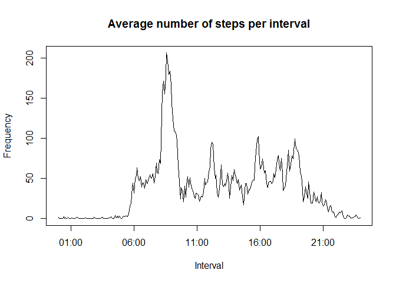
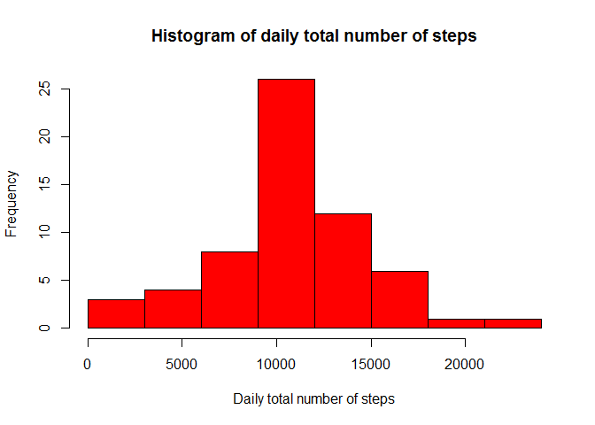

# Reproducible Research: Peer Assessment 1


## Loading and preprocessing the data.
Load useful libraries.


```r
library(dplyr)
```

```
## 
## Attaching package: 'dplyr'
## 
## The following object is masked from 'package:stats':
## 
##     filter
## 
## The following objects are masked from 'package:base':
## 
##     intersect, setdiff, setequal, union
```

```r
library(tidyr)
library(stringr)
library(ggplot2)
library(scales)
```

Load the data, specifying the header and column classes.


```r
data <- read.csv("activity.csv",colClasses=c("numeric","character","character"),
                 header=TRUE)
```

Then, convert the date variable from a character to a Date.


```r
data$date <- as.Date(data$date, format="%Y-%m-%d")
```

Also, pad the interval with zeros to make all of them 4 digits.
Add a colon so the format is HH:MM.


```r
data$interval <- str_pad(data$interval,4,pad="0")
data$interval <- sub("^([0-9]{2})","\\1:",data$interval)
```


## What are the mean and median total number of steps taken per day?

Group the observations by date and then get the total number of steps per day.
Make sure to remove NAs.


```r
g_data <- group_by(data,date)
s_data <- summarize(g_data,tot_daily_steps=sum(steps[!is.na(steps)]))
```

Make a histogram of the number of steps per day.


```r
hist(s_data$tot_daily_steps, col="red", breaks=seq(0,24000,3000),
     xlab="Daily total number of steps",ylab="Frequency",
     main="Histogram of daily total number of steps")
```

 

Now get the mean number of steps per day.


```r
mean(s_data$tot_daily_steps)
```

```
## [1] 9354.23
```

Now get the median number of steps per day.


```r
median(s_data$tot_daily_steps)
```

```
## [1] 10395
```

## What is the average daily activity pattern?

Group data by interval, then calculate average number of steps per interval.


```r
int_group <- group_by(data,interval)
int_mean <- summarize(int_group,steps=mean(steps[!is.na(steps)]))
```

Convert interval to POSIXlt, then plot this data in a time-series format.


```r
plot(as.POSIXlt(int_mean$interval,format="%H:%M"),int_mean$steps,
     xlab="Interval", ylab="Frequency",
     main="Average number of steps per interval",
     type="l")
```

 

Which 5 minute interval contains the maximum average number of steps?


```r
int_mean$interval[int_mean$steps==max(int_mean$steps)]
```

```
## [1] "08:35"
```

## Imputing missing values

Get the total number of missing values.


```r
sum(is.na(data$steps))
```

```
## [1] 2304
```

To fill in missing values for a particular interval, we will use the mean
for that interval across all days.
This will be assigned to a new dataset, data2.
First, we add a column to the dataset which is the mean value for each interval.
Then we assign that value to the steps variable and delete the new variable


```r
data2 <- data
data2 <- left_join(data2,int_mean,by="interval")
NA_rows <- is.na(data2$steps.x)
data2[NA_rows,"steps.x"] <- data2[NA_rows,"steps.y"]
data2 <- data2[,1:3]
names(data2)[1] <- "steps"
tbl_df(data2)
```

```
## Source: local data frame [17,568 x 3]
## 
##        steps       date interval
## 1  1.7169811 2012-10-01    00:00
## 2  0.3396226 2012-10-01    00:05
## 3  0.1320755 2012-10-01    00:10
## 4  0.1509434 2012-10-01    00:15
## 5  0.0754717 2012-10-01    00:20
## 6  2.0943396 2012-10-01    00:25
## 7  0.5283019 2012-10-01    00:30
## 8  0.8679245 2012-10-01    00:35
## 9  0.0000000 2012-10-01    00:40
## 10 1.4716981 2012-10-01    00:45
## ..       ...        ...      ...
```

Now, we repeat the above calculations with the new dataset.
First, we make a histogram of the the total number of steps per day.
We have to group by date and sum over the groups


```r
g_data2 <- group_by(data2,date)
s_data2 <- summarize(g_data2,tot_daily_steps=sum(steps[!is.na(steps)]))
hist(s_data2$tot_daily_steps, col="red", breaks=seq(0,24000,3000),
     xlab="Daily total number of steps",ylab="Frequency",
     main="Histogram of daily total number of steps")
```

 

Now, we get the mean and median number of steps per day.


```r
mean(s_data2$tot_daily_steps)
```

```
## [1] 10766.19
```

```r
median(s_data2$tot_daily_steps)
```

```
## [1] 10766.19
```

These values are different from before due to the way we imputed the missing values.
There are many fewer days with 0 steps which affects the mean and median of the distribution.

## Are there differences in activity patterns between weekdays and weekends?

Get day of week as number (Sun-Sat = 0-6).
Then create a new factor variable that specifies if a day is a weekday or weekend.


```r
data2$day_type <- as.numeric(strftime(as.Date(data2$date,format="%Y-%m-%d"),format="%w"))
data2$day_type <- factor((data2$day_type == 0 | data2$day_type == 6))
levels(data2$day_type) = c("weekday","weekend")
```

Get mean number of steps per interval.


```r
int_group2 <- group_by(data2,interval,day_type)
int_mean2 <- summarize(int_group2,steps=mean(steps))
int_mean2
```

```
## Source: local data frame [576 x 3]
## Groups: interval
## 
##    interval day_type       steps
## 1     00:00  weekday 2.251153040
## 2     00:00  weekend 0.214622642
## 3     00:05  weekday 0.445283019
## 4     00:05  weekend 0.042452830
## 5     00:10  weekday 0.173165618
## 6     00:10  weekend 0.016509434
## 7     00:15  weekday 0.197903564
## 8     00:15  weekend 0.018867925
## 9     00:20  weekday 0.098951782
## 10    00:20  weekend 0.009433962
## ..      ...      ...         ...
```

Now make a panel plot of the daily activity level for weekdays and weekends using ggplot.
Have to convert interval to POSIXct first.


```r
int_mean2$interval <- as.POSIXct(int_mean2$interval,format="%H:%M")
g <- ggplot(int_mean2,aes(interval,steps))
g + geom_line() + facet_grid(day_type ~ .) +
  labs(x="Interval", y="Number of steps") +
  scale_x_datetime(labels=date_format("%H:%M"))            
```

 
